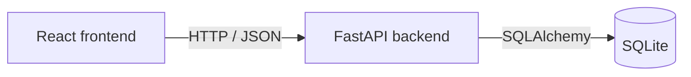

# Community Events Platform

A React and FastAPI application built for the Clickatell Graduate Full-Stack Developer take-home assessment.

| Demo role | Actions |
|---|---|
| Visitor | Browse published events and register anonymous interest |
| Event Organiser | Create, view, and update their own events |
| Administrator | View all events, filter by status, and publish pending events |

The role selector uses fictional identities `organiser-1` and `organiser-2`. It demonstrates the workflows without authentication or account creation. The backend checks organiser ownership when updating events, but the demo roles are not a security boundary.

## Technology and architecture

- **Frontend:** React 19, Vite 8, JavaScript, CSS, and the Fetch API.
- **Backend:** Python, FastAPI, Pydantic, SQLAlchemy, and Uvicorn.
- **Persistence:** SQLite.
- **Checks:** Pytest with FastAPI TestClient, ESLint, and a Vite production build.

Exact backend versions are pinned in `backend/requirements.txt`; frontend versions are recorded in `frontend/package-lock.json`.



One backend service keeps the event, registration, and activity workflows straightforward to run and explain. SQLite provides persistence without an external database or credentials.

## Setup and run

The commands below use Windows PowerShell. Clone the repository and open a terminal in its root directory.

### Prerequisites

- Python 3.9 or later (tested with Python 3.9.13).
- Node.js 22.x, version 22.13.0 or newer, or Node.js 24.x.
- npm and Git.

### Backend

From the repository root:

```powershell
py -m venv backend\.venv
backend\.venv\Scripts\Activate.ps1
python -m pip install -r backend\requirements.txt
```

If activation is blocked by PowerShell, run `Set-ExecutionPolicy -Scope Process -ExecutionPolicy Bypass` in that terminal, then activate again.

For fictional demo data, run from the repository root before starting the server:

```powershell
python -m backend.seed
```

The seed script creates three future events:

| Event | Organiser | Status | Capacity |
|---|---|---|---:|
| Community Coding Workshop | organiser-1 | PUBLISHED | 25 |
| Local Technology Meetup | organiser-2 | PENDING_REVIEW | 40 |
| Small Coding Session | organiser-1 | PUBLISHED | 1 |

Seeding is skipped if any events already exist. No organiser account records are needed.

Start the API from the repository root:

```powershell
uvicorn backend.app.main:app --reload --no-access-log
```

The `--no-access-log` flag disables Uvicorn's default access logs so they do not record visitor IP addresses. Application logging remains enabled.

- API: [http://127.0.0.1:8000](http://127.0.0.1:8000)
- Swagger UI: [http://127.0.0.1:8000/docs](http://127.0.0.1:8000/docs)
- Health check: [http://127.0.0.1:8000/health](http://127.0.0.1:8000/health)

### Frontend

Open a second terminal in the repository root:

```powershell
cd frontend
npm ci
npm run dev
```

Open [http://localhost:5173](http://localhost:5173). Both servers must be running. The frontend calls `http://127.0.0.1:8000`, and backend CORS permits `http://localhost:5173`. If that frontend port is occupied, free it and restart Vite.

No environment variables, API keys, or external services are required for the documented setup.

## Persistence and data model

The backend creates `events.db` in its working directory. Starting the server and seed script from the repository root ensures they use the same database. Data survives application restarts; the database, virtual environment, build output, and Node modules are ignored by Git.

| Entity | Stored fields |
|---|---|
| Event | `id`, `title`, `description`, `date_time`, `capacity`, `status`, `organiser_id`, `created_at`, `updated_at` |
| Registration | `id`, `event_id`, `registered_at` |
| Activity | `id`, `event_id`, optional `registration_id`, `action`, `created_at` |

Registrations require no request body or visitor details. They contain no names, contact details, IP addresses, device fingerprints, or free-text notes. Duplicate anonymous registrations are allowed because visitors have no identifying account or token.

Publishing records an `EVENT_PUBLISHED` activity. Registering interest records a `REGISTRATION_CREATED` activity in the same database transaction as the registration.

## Business rules

- New events start as `PENDING_REVIEW`. Visitors see only `PUBLISHED` events.
- Titles and organiser identifiers are trimmed and cannot be blank. Titles are limited to 200 characters and organiser identifiers to 100.
- Event dates must be valid and in the future when supplied on creation or update.
- Offset-free dates use the backend machine's local timezone. Offset-bearing dates are converted to that timezone before validation and stored/returned without an offset. The React `datetime-local` input and seed script use local time; the demo assumes browser and backend share the same timezone.
- Capacity must be a positive whole number; booleans are rejected.
- Updates can omit fields, but `title`, `date_time`, and `capacity` cannot explicitly be null. Description can be cleared with null.
- Updates must match the organiser identifier in the route. Editing a published event leaves it published.
- Capacity cannot be reduced below existing registrations.
- Registration is allowed only for published events with remaining capacity. Publishing an already published event is rejected.

## API reference

| Method | Endpoint | Purpose | Success |
|---|---|---|---:|
| POST | `/api/events` | Create a pending event | 201 |
| GET | `/api/events` | List published events | 200 |
| GET | `/api/organisers/{organiser_id}/events` | List an organiser's events | 200 |
| PUT | `/api/organisers/{organiser_id}/events/{event_id}` | Update supplied event fields | 200 |
| GET | `/api/admin/events` | List all events | 200 |
| POST | `/api/admin/events/{event_id}/publish` | Publish a pending event | 200 |
| POST | `/api/events/{event_id}/registrations` | Register anonymous interest | 201 |

Swagger UI includes request schemas and lets reviewers exercise the endpoints directly.

Invalid input returns **400** with `code`, `message`, and field-level `errors`. Missing events or organiser ownership mismatches return **404**. Business conflicts return **409**, with a code and message inside `detail`:

- `EVENT_NOT_PUBLISHED`
- `EVENT_FULL`
- `EVENT_ALREADY_PUBLISHED`
- `CAPACITY_BELOW_REGISTRATIONS`

Unexpected errors return a generic **500** response; server-side logs retain diagnostic details. Event content is rendered as plain text in React.

## Demonstration guide

Use seeded data and keep the backend terminal visible.

1. **Visitor:** Select Visitor, inspect the published event cards, and register interest in Community Coding Workshop. Confirm the success message and generated registration ID.
2. **Organiser:** Select Event Organiser and Organiser 1. Create an event with a future date and positive capacity. Confirm its Pending review badge, edit it, and verify the updated values. Switch to Organiser 2 to confirm a different event list. Switch to Visitor and confirm the new pending event is absent.
3. **Administrator:** Select Administrator, use the Pending Review filter, and publish the event created in step 2. Switch to Visitor and confirm it is visible.
4. **Capacity rule:** Register interest in Small Coding Session, whose seeded capacity is one. A second registration returns the full-event error. This assumes the event has no existing registrations.
5. **Unpublished rule:** In Swagger UI, use `GET /api/admin/events` to find a pending event ID. Call its registration endpoint and confirm **409 / EVENT_NOT_PUBLISHED**.
6. **Logging:** Perform a registration and inspect the request, operation, and completion logs described below.

## Logging and request IDs

The middleware accepts an `X-Request-ID` header or generates a UUID, then returns it in the response header. Request logs include the ID, method, path, and completion status. Validation failures and unexpected errors are logged with the request ID. Publishing and registration operation logs include relevant entity IDs and a success outcome.

A successful registration produces entries like these (timestamps omitted):

```text
request_received request_id=<request-id> method=POST path=/api/events/1/registrations
registration_created event_id=1 registration_id=1 outcome=success
request_completed request_id=<request-id> method=POST path=/api/events/1/registrations status_code=201
```

The same transaction also writes the registration's activity record to SQLite.

## Tests and frontend checks

With the backend virtual environment activated, run from the repository root:

```powershell
python -m pytest backend/tests -v
```

Business-rule tests use a separate in-memory SQLite database. They cover creation, pending-event visibility, publishing, ownership, unpublished/full registration rejection, timezone handling, null update validation, nullable descriptions, blank required text, boolean capacity, capacity reductions, persisted activity, and rollback when activity creation fails.

Run the frontend checks from `frontend`:

```powershell
npm run lint
npm run build
```

The most recent verification completed with **23 backend tests passed**, frontend lint passed, and production build passed. Frontend unit tests are not included; use the demonstration guide to check the UI workflows.

## Scope and trade-offs

- The demo uses predefined organiser identities and a role selector. Authentication and organiser/account creation are out of scope.
- Anonymous visitors may register more than once. Registration counts and activity history are persisted but have no dedicated dashboard.
- Capacity checks do not serialize concurrent registrations. This limitation is documented; advanced concurrency handling was excluded from the assessment scope.
- Administrator status filtering is included. Visitor search, pagination, event rejection/cancellation, and registration cancellation are not implemented.
- The project runs locally with one backend service. Docker, cloud deployment, CI/CD, and real messaging integrations are intentionally excluded.

With more time, useful improvements within this application's scope would be displaying remaining capacity and activity history, adding visitor filtering, and adding focused frontend workflow tests.

## AI-use declaration

ChatGPT and Codex were used for requirement analysis, API design, code assistance, debugging, test design, documentation, review, and UI presentation improvements.

I reviewed and integrated the generated suggestions, tested API and frontend workflows locally, checked business rules and logs, and ran the automated checks. I remain responsible for understanding and explaining the submitted implementation.
