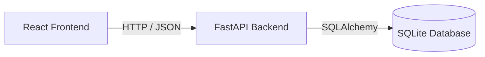
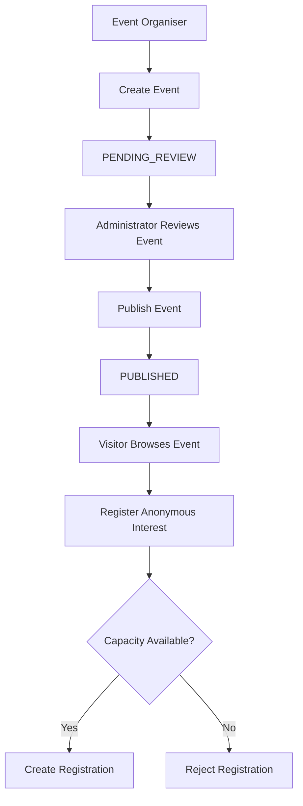

# Community Events Platform

A small full-stack Community Events Platform developed for the Clickatell Graduate Full-Stack Developer take-home assessment.

The application demonstrates three roles:

- **Visitor** — browse published events and register anonymous interest.
- **Event Organiser** — create, view, and update events they manage.
- **Administrator** — review all events and publish events awaiting review.

The project intentionally focuses on a small, complete, understandable implementation rather than unnecessary infrastructure or advanced features.

---

## Technology Stack

### Frontend

- React
- Vite
- JavaScript
- CSS
- Fetch API

### Backend

- Python 3.9
- FastAPI
- SQLAlchemy
- Pydantic
- Uvicorn

### Persistence

- SQLite

### Testing

- Pytest
- FastAPI `TestClient`
- HTTPX

### Source Control

- Git
- GitHub

---

# Architecture

The application uses a simple modular monolith architecture.



The React frontend provides role-specific interfaces while the FastAPI backend handles validation, business rules, persistence, logging, and error handling.

A single backend service was deliberately chosen because the application requirements can be handled cleanly within one service. Introducing additional services would add deployment and communication complexity without providing meaningful value for the scope of this assessment.

---

# Application Workflow



New events always begin with the status:

```text
PENDING_REVIEW
```

Only an Administrator can move an event to:

```text
PUBLISHED
```

Only published events are visible to Visitors.

---

# Demo Roles

Production authentication was intentionally excluded from the implementation.

The frontend provides a role selector for demonstration purposes.

Available roles:

```text
Visitor

Event Organiser
    Organiser 1
    Organiser 2

Administrator
```

Internally, the seeded organiser identifiers are:

```text
organiser-1
organiser-2
```

These are fictional demonstration identities and contain no real personal information.

---

# Data Model

The application stores three main entities.

## Event

Each event contains:

```text
id
title
description
date_time
capacity
status
organiser_id
created_at
updated_at
```

Possible statuses currently implemented:

```text
PENDING_REVIEW
PUBLISHED
```

New events automatically start as `PENDING_REVIEW`.

---

## Registration

Visitor registrations are intentionally anonymous.

A registration contains only:

```text
id
event_id
registered_at
```

The system does **not** collect or store:

- Names
- Email addresses
- Phone numbers
- Addresses
- IP addresses
- Device fingerprints
- Free-text visitor information

Duplicate registrations are allowed because Visitors are anonymous.

---

## Activity

Important operations are also recorded as activity entries.

An activity contains:

```text
id
event_id
registration_id
action
created_at
```

Examples include:

```text
EVENT_PUBLISHED
REGISTRATION_CREATED
```

The registration ID is optional because some activities, such as publishing an event, do not involve a registration.

---

# Project Structure

```text
community-events-platform/
│
├── backend/
│   ├── app/
│   │   ├── __init__.py
│   │   ├── database.py
│   │   ├── logging_config.py
│   │   ├── main.py
│   │   ├── models.py
│   │   └── schemas.py
│   │
│   ├── tests/
│   │   ├── __init__.py
│   │   └── test_events.py
│   │
│   ├── requirements.txt
│   └── .venv/
│
├── frontend/
│   ├── public/
│   ├── src/
│   │   ├── services/
│   │   │   └── api.js
│   │   ├── App.css
│   │   ├── App.jsx
│   │   ├── index.css
│   │   └── main.jsx
│   │
│   ├── package.json
│   └── package-lock.json
│
├── .gitignore
└── README.md
```

The virtual environment, SQLite database, Node modules and other generated files are excluded from source control.

---

# Setup and Run

## Prerequisites

Ensure the following are installed:

- Python 3.9 or later
- Node.js 22.13.x or 24.x (compatible with the locked Vite and ESLint versions)
- npm
- Git

---

# Backend Setup

Run the following commands from the root of your cloned repository.

Create a Python virtual environment if one does not already exist:

```powershell
py -m venv backend\.venv
```

Activate it:

```powershell
backend\.venv\Scripts\Activate.ps1
```

If PowerShell blocks script execution for the current terminal:

```powershell
Set-ExecutionPolicy -Scope Process -ExecutionPolicy Bypass
```

Then activate the environment again.

Install dependencies:

```powershell
pip install -r backend\requirements.txt
```

Start the FastAPI server:

```powershell
uvicorn backend.app.main:app --reload --no-access-log
```

The backend will run at:

```text
http://127.0.0.1:8000
```

Swagger/OpenAPI documentation is available at:

```text
http://127.0.0.1:8000/docs
```

Health endpoint:

```text
GET http://127.0.0.1:8000/health
```

---

## Optional Demo Data

The application can be populated with fictional demo events using the included seed script.

With the backend virtual environment activated, run from the project root:

```powershell
python -m backend.seed
```

The script creates sample events for:

```text
organiser-1
organiser-2
```

including both `PUBLISHED` and `PENDING_REVIEW` events.

If event data already exists, the seed script exits without creating duplicates.

All seeded data is fictional and contains no real personal information.

---

# Frontend Setup

Open a second terminal.

From the project root:

```powershell
cd frontend
```

Install dependencies:

```powershell
npm ci
```

Start the React development server:

```powershell
npm run dev
```

The frontend normally runs at:

```text
http://localhost:5173
```

Both the frontend and backend must be running for the complete application workflow.

---

# Persistence

SQLite is used for persistent storage.

The database file is created automatically when the backend starts.

The application stores:

- Events
- Anonymous registrations
- Activity records

The database survives application restarts.

The local SQLite database file is intentionally excluded from Git using `.gitignore`.

This keeps runtime data separate from the repository.

The demonstration organiser identifiers are:

```text
organiser-1
organiser-2
```

Additional demonstration event data can be created through the Organiser interface.

---

# API Overview

## Events

### Create an event

```text
POST /api/events
```

Example request:

```json
{
  "title": "Community Coding Workshop",
  "description": "Introductory coding workshop for local residents.",
  "date_time": "2026-10-20T10:00:00",
  "capacity": 25,
  "organiser_id": "organiser-1"
}
```

Successful response:

```text
201 Created
```

New events automatically receive:

```text
PENDING_REVIEW
```

---

### Browse published events

```text
GET /api/events
```

Only `PUBLISHED` events are returned.

---

### View organiser events

```text
GET /api/organisers/{organiser_id}/events
```

Example:

```text
GET /api/organisers/organiser-1/events
```

---

### Update an organiser event

```text
PUT /api/organisers/{organiser_id}/events/{event_id}
```

The backend verifies that the event belongs to the organiser specified in the route.

---

# Administrator API

### View all events

```text
GET /api/admin/events
```

This includes:

```text
PENDING_REVIEW
PUBLISHED
```

events.

---

### Publish an event

```text
POST /api/admin/events/{event_id}/publish
```

Publishing changes the event status from:

```text
PENDING_REVIEW
```

to:

```text
PUBLISHED
```

After publication, the event becomes visible through the Visitor endpoint.

---

# Registration API

### Register anonymous interest

```text
POST /api/events/{event_id}/registrations
```

No request body is required because the system deliberately collects no visitor personal information.

A successful registration returns:

```text
201 Created
```

Example:

```json
{
  "id": 1,
  "event_id": 1,
  "registered_at": "2026-10-06T15:31:37"
}
```

---

# Business Rules

The backend enforces the following rules.

## Event validation

- Title is required.
- Event date/time must be valid.
- Event date/time cannot be in the past.
- Event dates without an offset are interpreted in the backend machine's local timezone, matching the React `datetime-local` input when browser and backend use the same timezone. Offset-bearing dates are converted to that local timezone before validation and stored/returned without an offset. Seed dates use the same local-time convention.
- Capacity must be a whole number greater than zero.
- Boolean capacity values and whitespace-only titles or organiser identifiers are rejected.
- Updates may omit fields, but cannot explicitly set title, date/time, or capacity to null. Description may be cleared with null.
- Capacity cannot be reduced below the number of existing registrations; this returns `409 Conflict` with code `CAPACITY_BELOW_REGISTRATIONS`.
- Organiser identifier is required.

## Publishing

- New events start as `PENDING_REVIEW`.
- Visitors cannot see pending events.
- Administrators can publish pending events.

## Registration

Registration is allowed only when:

```text
event.status == PUBLISHED
```

and:

```text
registration_count < event.capacity
```

An unpublished event returns:

```text
409 Conflict
```

with:

```json
{
  "detail": {
    "code": "EVENT_NOT_PUBLISHED",
    "message": "Registration is only available for published events."
  }
}
```

A full event returns:

```text
409 Conflict
```

with:

```json
{
  "detail": {
    "code": "EVENT_FULL",
    "message": "Registration is no longer available because this event is full."
  }
}
```

---

# Validation and Error Handling

Validation occurs on the backend using Pydantic.

Invalid request data returns:

```text
400 Bad Request
```

Example:

```json
{
  "code": "VALIDATION_ERROR",
  "message": "The request contains invalid data.",
  "errors": [
    {
      "field": "capacity",
      "message": "Input should be greater than 0"
    }
  ]
}
```

Common application responses include:

| Scenario | HTTP Status |
|---|---:|
| Event created | `201 Created` |
| Event retrieved | `200 OK` |
| Event updated | `200 OK` |
| Invalid request | `400 Bad Request` |
| Event not found | `404 Not Found` |
| Registration rejected | `409 Conflict` |
| Event already published | `409 Conflict` |
| Unexpected server error | `500 Internal Server Error` |

Unexpected errors are logged server-side while the client receives a generic response that does not expose database details, stack traces, file paths, configuration values or framework internals.

Example:

```json
{
  "code": "INTERNAL_SERVER_ERROR",
  "message": "An unexpected server error occurred."
}
```

---

# Logging and Correlation IDs

The backend uses application logging for important operations.

Start Uvicorn with `--no-access-log` as shown above so its default access logger does not record visitor IP addresses. Application request logs remain enabled.

Every request receives a request/correlation ID.

If the caller supplies:

```text
X-Request-ID
```

the supplied value is used.

Otherwise the server generates a UUID.

The request ID is also returned through the response header:

```text
X-Request-ID
```

Example log flow:

```text
request_received
request_id=82ded613-eaa6-4f69-8148-eb6e4df64871
method=POST
path=/api/admin/events/2/publish

event_published
event_id=2
outcome=success

request_completed
request_id=82ded613-eaa6-4f69-8148-eb6e4df64871
status_code=200
```

Registration logs contain both the event and registration IDs:

```text
registration_created
event_id=2
registration_id=3
outcome=success
```

Validation failures are also logged with the associated request ID.

---

# Automated Testing

The project contains focused backend tests for business rules rather than framework implementation details.

Run:

```powershell
pytest backend\tests -v
```

The original core test scenarios are:

```text
test_create_event_successfully
test_reject_invalid_capacity
test_reject_past_event_date
test_visitor_cannot_see_unpublished_event
test_publishing_makes_event_visible
test_wrong_organiser_cannot_update_event
test_reject_registration_for_unpublished_event
test_reject_registration_when_event_is_full
```

Additional regression tests cover timezone-bearing dates, null required update fields, nullable descriptions, whitespace-only required text, boolean capacity, capacity reductions, persisted registration activity, and rollback when activity creation fails.

The tests use a separate in-memory SQLite database so automated testing does not modify the application's normal database.

---

# Required Demonstration Guide

## 1. Visitor Workflow

1. Start the backend.
2. Start the frontend.
3. Open:

```text
http://localhost:5173
```

4. Select **Visitor**.
5. Browse published events.
6. Select **Register Interest**.
7. Confirm that a successful registration message appears.
8. Attempt registration against a full event to demonstrate the capacity rule.

---

## 2. Event Organiser Workflow

1. Select **Event Organiser**.
2. Select either:
   - Organiser 1
   - Organiser 2
3. Confirm that only events belonging to that organiser are shown.
4. Create a new event.
5. Confirm its status is:

```text
PENDING_REVIEW
```

6. Switch to Visitor.
7. Confirm that the event is not visible.
8. Return to the organiser.
9. Edit the event.
10. Confirm the updated values appear.

---

## 3. Administrator Workflow

1. Select **Administrator**.
2. Confirm that both pending and published events are visible.
3. Find the newly created pending event.
4. Select **Publish Event**.
5. Confirm its status becomes:

```text
PUBLISHED
```

6. Switch to Visitor.
7. Confirm the newly published event is now visible.

---

## 4. Registration Rules

Demonstrate the following scenarios.

### Published event with capacity

```text
POST registration
→ 201 Created
```

### Unpublished event

```text
POST registration
→ 409 Conflict
→ EVENT_NOT_PUBLISHED
```

### Full event

```text
POST registration
→ 409 Conflict
→ EVENT_FULL
```

---

## 5. Logging Workflow

Keep the backend terminal visible.

Perform a registration through the frontend.

The logs should demonstrate:

```text
request_received
→ registration created
→ activity recorded
→ request_completed
```

The log entries include the correlation/request ID and relevant event/registration identifiers.

---

# Design Decisions and Trade-offs

## SQLite instead of a hosted database

SQLite was chosen because this is a small take-home exercise intended to be completed within a limited period.

It provides real persistence across application restarts without requiring external database infrastructure or credentials.

For a larger production system, PostgreSQL or another managed relational database would likely be more appropriate.

---

## Single backend service

The project uses one FastAPI backend rather than introducing a second service.

The event, registration and activity domains are small enough to remain understandable within a single modular application.

A second service would introduce additional HTTP communication, failure handling and infrastructure complexity that is not justified for the current scope.

---

## SQLAlchemy

SQLAlchemy is used to separate database access from the underlying SQLite implementation and provide clear Python models for the application's data.

For this relatively small application, it provides useful structure without requiring significant additional infrastructure.

---

## Demo role selector instead of authentication

Production authentication was intentionally not implemented.

The application instead provides demonstration roles through the frontend.

This keeps the implementation focused on the business workflows while avoiding unrelated authentication infrastructure.

Server-side organiser ownership checks were still added for event updates.

---

## Anonymous registrations

Visitors do not provide accounts or personal information.

This means duplicate-registration prevention is intentionally not implemented because there is no safe identifier available for determining whether the same anonymous Visitor has previously registered.

---

## No frontend testing

Frontend automated tests were not prioritised because the assignment focuses on backend business-rule testing and the primary frontend workflows can be demonstrated directly.

---

# Known Limitations

The current implementation intentionally has several limitations.

- Authentication and authorization are demonstration-only.
- Organiser identities are predefined.
- There is no registration cancellation workflow.
- Duplicate anonymous registrations are allowed.
- Registration capacity checks are designed for the scope of this exercise and do not implement advanced concurrency control.
- There is no pagination or visitor search/filtering. The Administrator view includes status filtering for all, pending, or published events.
- There is no event rejection workflow.
- There is no event cancellation workflow.
- There is no cloud deployment.
- There is no real email, SMS, WhatsApp or push notification integration.
- Styling prioritises usability over advanced visual design.

---

# Future Improvements

With additional development time, possible improvements would include:

- Production authentication and authorization.
- Proper organiser/user accounts.
- PostgreSQL persistence.
- Database migrations using Alembic.
- Registration counts displayed directly on events.
- Admin activity/history dashboard.
- Visitor event search and filtering.
- Pagination.
- Event cancellation or rejection workflows.
- More backend test scenarios.
- Frontend automated tests.
- Docker support.
- CI/CD.
- Cloud deployment.
- Additional observability and structured logging.
- Improved responsive styling.
- Concurrency-safe capacity reservation for high-volume environments.

These improvements were intentionally excluded so that the required functionality could remain complete, focused and understandable.

---

# Security and Privacy Considerations

The implementation includes several basic safeguards:

- Backend input validation.
- No visitor personal information is collected.
- No secrets or credentials are required.
- `.env` files are ignored.
- Raw internal exceptions are not returned to clients.
- Event content is rendered as text rather than trusted HTML.
- Organiser ownership is checked server-side when updating events.
- Generic `500` responses prevent internal implementation details from being exposed.

---

# AI Use Declaration

AI tools were used during development of this project.

Tools used included ChatGPT for:

- Requirement analysis.
- Architecture and API design discussion.
- Code generation assistance.
- Debugging.
- Test design.
- Error-handling improvements.
- Documentation support.
- Reviewing engineering trade-offs.

AI-generated suggestions were not accepted blindly.

I personally:

- Created and maintained the Git repository.
- Ran and reviewed all code locally.
- Tested API endpoints manually through Swagger.
- Tested all frontend workflows in the browser.
- Verified event creation and publishing behaviour.
- Verified anonymous registration behaviour.
- Verified capacity enforcement.
- Verified organiser ownership behaviour.
- Reviewed application logs and correlation IDs.
- Ran and reviewed the automated Pytest suite.
- Modified and integrated generated code where necessary.
- Reviewed the implementation so that I can explain the submitted solution and its technical decisions.

AI was used as a development assistant rather than as a replacement for understanding, testing or validating the solution.

---

# Git and Development Approach

The project was developed incrementally using Git.

Examples of development milestones include:

```text
chore: initialise community events platform
feat: add SQLite database and event model
feat: add event creation and validation
feat: add role-based event retrieval
feat: add admin event publishing
feat: add anonymous registration and capacity rules
feat: add organiser event updates
feat: add activity records and request logging
test: add backend business rule coverage
feat: initialise React frontend
feat: add role selector interface
feat: connect visitor view to published events API
feat: add visitor event registration
feat: add organiser event management
feat: add administrator publishing dashboard
refactor: improve API validation and error handling
```

This incremental approach helped keep changes understandable, testable and easy to review.

---

# Summary

The application demonstrates a complete end-to-end Community Events workflow:

```text
Organiser creates event
        ↓
PENDING_REVIEW
        ↓
Administrator publishes
        ↓
PUBLISHED
        ↓
Visitor sees event
        ↓
Visitor registers anonymous interest
        ↓
Capacity enforced
        ↓
Activity + logging recorded
```

The implementation prioritises correctness, clarity, backend validation, useful error handling, focused automated testing and explainable engineering decisions over unnecessary infrastructure or advanced features.
